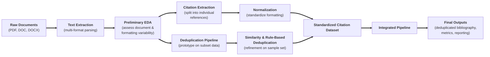

# Youth-Nex-Capstone Citation Pipeline
A data pipeline for extracting, normalizing, deduplicating, and reporting bibliographic citations from YouthNex annual appendix documents.

---

## Overview
This project automates the process of extracting citation data from yearly appendix documents (PDF, DOC, DOCX, etc.), deduplicating references across years, and generating clean bibliographic outputs for reporting and analysis.

**Pipeline flow:**

---

## Repository Structure

Data Input Requirements 

 

Directory Organization 
- The base directory (`BASE`) must contain year-level subfolders: 
`BASE/ 
    2020/ 
    2021/ 
    2022/ 
    2023/ 
    2024/ 
    2025/` 
- Each year folder is processed independently. 

Appendix Folder Identification 
- Within each year folder, the pipeline searches recursively for subdirectories containing the keyword: `appendices` 
- Matching is:  
    - case-insensitive  
    - based on partial string match (e.g., `Appendices`, `appendices_final`, etc.) 

Target File Selection 
- Within identified appendix folders, files are selected if their filenames contain:  
    - `"final"` OR  
    - `" lb"` (note: includes a leading space before "lb")  
- Matching is:  
    - case-insensitive
    - applied to the full filename
 
