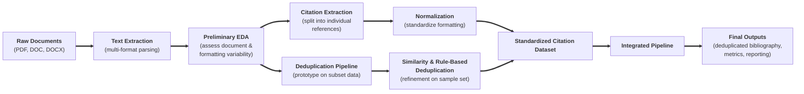

# Youth-Nex-Capstone Citation Pipeline
A data pipeline for extracting, normalizing, deduplicating, and reporting bibliographic citations from YouthNex annual appendix documents.

---

## Overview
This project automates the process of extracting citation data from yearly appendix documents (PDF, DOC, DOCX), deduplicating references across years, and generating clean bibliographic outputs for reporting and analysis.

**Pipeline flow:**

---

## Repository Structure
| File | Description |
|---|---|
| `official_youthnex_pipeline.ipynb` | Main end-to-end complete pipeline notebook |
| `bibliography_extraction.ipynb` | Citation extraction from raw text only |
| `deduplication_function_final.ipynb` | Deduplication logic and similarity matching only |
| `preprocessing_aggregation_ARD.ipynb` | Preprocessing for ARD documents only |
| `preprocessing_aggregation_CVs.ipynb` | Preprocessing for CV documents only |
| `project_flow_diagram.md` | Mermaid diagram of pipeline architecture only |

---

## Data Input Requirements

### Input File Constraints

- Input must be a `.zip` archive containing the final appendix documents for a given year.
- Supported file types within the extracted `.zip`: `.doc`, `.docx`, `.pdf`

### Appendix Folder Identification

The pipeline recursively searches each year folder for subdirectories containing the keyword `appendices` (case-insensitive, partial match — e.g., `Appendices`, `appendices_final`).

### Target File Selection

Within identified appendix folders, files are selected if their filenames contain:
- `"final"` OR
- `" lb"` *(note: includes a leading space)*

Matching is case-insensitive and applied to the full filename.

---

## Outputs

### User-Facing Outputs

| File | Description | Use Cases |
|---|---|---|
| `deduplicated_citations.csv` | Final cleaned dataset of unique citations | Data analysis, dashboards, internal reporting |
| `bibliography_clean.pdf` | Formatted bibliography from deduplicated citations | Annual reports, grant submissions, stakeholder deliverables |

### Output Infographics

The pipeline generates three summary visualizations:

- **Deduplication Summary** — Total vs. unique citations and percentage reduction
- **Deduplication Impact** — Visual comparison of original vs. unique citation counts
- **Top 10 Most Frequent Authors** — Citation counts for the highest-output researchers

### Runtime Artifacts (Left Sidebar / Folders)

| Folder | Contents |
|---|---|
| `/youthnex_txt_spaces` | `.txt` versions of extracted source documents |
| `/biblio_exports` | Categorized extraction CSVs: candidates, needs review (no citation / no section), problem citations |
| `/converted_docx` | `.docx` files converted from `.doc` format |
| `/dedup_exports` | Final outputs: `deduplicated_citations.csv` and `bibliography_clean.pdf` |

---

## Getting Started

1. Clone or download documents from this repository.
2. Open `official_youthnex_pipeline.ipynb` in Jupyter or Google Colab.
3. Set your `BASE` directory path to point to your year-organized appendix folders.
4. Upload your `.zip` archive when prompted.
5. Run all cells. Outputs will appear in `/dedup_exports`.

---

## Requirements

- Google Colab (no local installation required)
- A Google account to access Colab
- Dependencies are handled within the notebook itself
