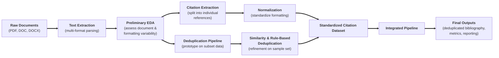

# Youth-Nex-Capstone Citation Pipeline
A data pipeline for extracting, normalizing, deduplicating, and reporting bibliographic citations from YouthNex annual appendix documents.

---

## Overview
This project automates the process of extracting citation data from yearly appendix documents (PDF, DOC, DOCX), deduplicating references across years, and generating clean bibliographic outputs for reporting and analysis.

**Pipeline flow:**

---

## Repository Structure
| File | Description |
|---|---|
| `official_youthnex_pipeline.ipynb` | Main end-to-end complete pipeline notebook |
| `bibliography_extraction.ipynb` | Citation extraction from raw text only |
| `deduplication_function_final.ipynb` | Deduplication logic and similarity matching only |
| `preprocessing_aggregation_ARD.ipynb` | Preprocessing for ARD documents only |
| `preprocessing_aggregation_CVs.ipynb` | Preprocessing for CV documents only |
| `project_flow_diagram.md` | Mermaid diagram of pipeline architecture only |

---

## Data Input Requirements

The base directory (`BASE`) must contain year-level subfolders:

```
BASE/
  2020/
  2021/
  2022/
  2023/
  2024/
  2025/
```

Each year folder is processed independently.

### Input File Constraints

- Input must be a `.zip` archive containing the final appendix documents for a given year.
- Supported file types within the extracted `.zip`: `.doc`, `.docx`, `.pdf`

### Appendix Folder Identification

The pipeline recursively searches each year folder for subdirectories containing the keyword `appendices` (case-insensitive, partial match — e.g., `Appendices`, `appendices_final`).

### Target File Selection

Within identified appendix folders, files are selected if their filenames contain:
- `"final"` OR
- `" lb"` *(note: includes a leading space)*

Matching is case-insensitive and applied to the full filename.


