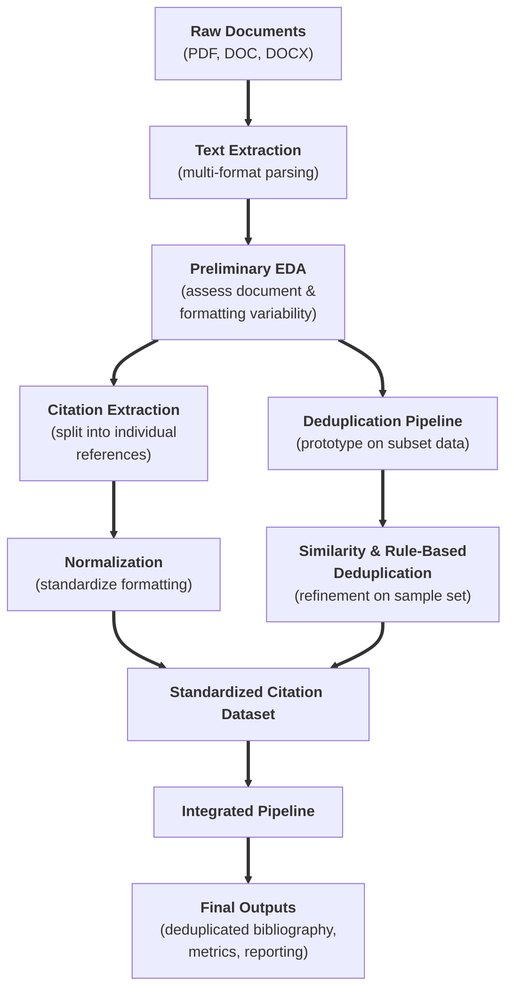

```mermaid
flowchart TB

A["<b>Raw Documents</b><br/>(PDF, DOC, DOCX)"] ==> B["<b>Text Extraction</b><br/>(multi-format parsing)"]

B ==> C["<b>Preliminary EDA</b><br/>(assess document &<br/>formatting variability)"]

C ==> D["<b>Citation Extraction</b><br/>(split into individual<br/>references)"]
D ==> N["<b>Normalization</b><br/>(standardize formatting)"]

%% Parallel development track
C ==> E["<b>Deduplication Pipeline</b><br/>(prototype on subset data)"]
E ==> F["<b>Similarity & Rule-Based<br/>Deduplication</b><br/>(refinement on sample set)"]

%% Integration step
N ==> G["<b>Standardized Citation Dataset</b>"]
F ==> G

G ==> H["<b>Integrated Pipeline</b>"]

H ==> I["<b>Final Outputs</b><br/>(deduplicated bibliography,<br/>metrics, reporting)"]
```